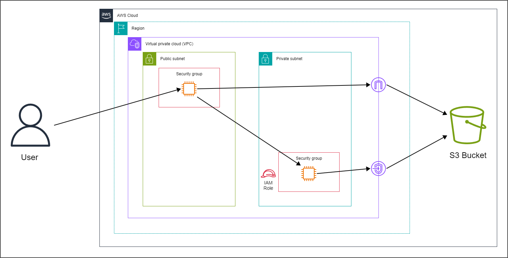

# S3 Gateway Endpoint for Private Instances

In this project, my goal was to understand how VPC Endpoints work and when to deploy them. To accomplish my goal, I have created a basic architecture and then created it with Terraform.

> **Note**
> If you want to use this architecture, you may want to change the variables in the `variables.tf` file
